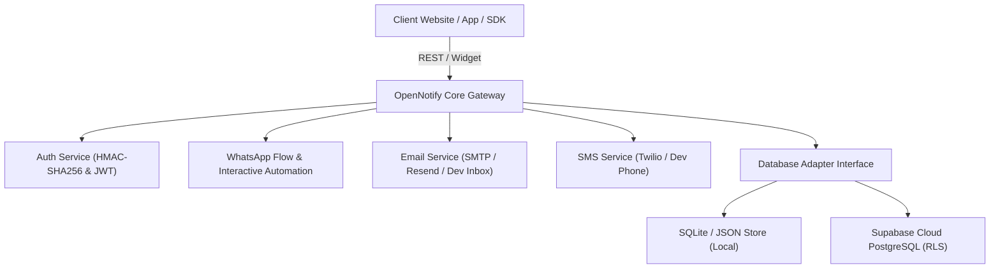

# ⚡ OpenNotify — Enterprise Customer Communication & In-House Auth Gateway

An open-source, production-ready **Unified In-House Authentication & Multi-Channel Notification Gateway** (Email, SMS & Interactive WhatsApp with Clickable Buttons) featuring a Zero-Config SQLite local engine and native **Supabase PostgreSQL** cloud sync.

---

## 🌟 Key Features

- **🛡️ In-House Passwordless Auth**: 6-digit numeric OTPs and cryptographic Magic Links with SHA-256 token hashing, brute-force protection, and single-use tokens.
- **💬 Interactive WhatsApp Engine**: Meta Cloud API v18.0 & Twilio WhatsApp integration supporting custom interactive templates with **clickable quick-reply buttons** and automated branch responses.
- **📱 Multi-Channel Support**: Unified API for Email (SMTP / Resend), SMS (Twilio), and WhatsApp.
- **🗄️ Multi-Database Ready**: Runs out-of-the-box on zero-config local SQLite, or connects to **Supabase PostgreSQL / Self-Hosted Postgres** with Row Level Security (RLS).
- **🎨 Apple Obsidian Studio Dashboard**: Clean developer console with real-time simulators for WhatsApp, SMS, and Email, plus live interactive testing.
- **📦 1-Line Embeddable SDK**: Drop-in authentication modal widget for Vanilla HTML, React, Next.js, and Vue.
- **🐳 Docker Ready**: Multi-stage production `Dockerfile` and `docker-compose.yml` included.

---

## 🏗️ System Architecture



---

## 🚀 Quickstart (Under 1 Minute)

### 1. Clone & Install
```bash
git clone <your-repo-url>
cd notification-
npm install
```

### 2. Configure Environment
```bash
cp .env.example .env
```
*(Default settings run in 100% free local simulator mode with zero configuration).*

### 3. Start Development Server & Studio
```bash
npm run dev
```
Open **[http://localhost:3000](http://localhost:3000)** in your browser to access the Studio.

---

## 🐳 Production Docker Deployment

Run with Docker Compose in 1 command:
```bash
docker compose up -d
```
Your containerized OpenNotify gateway will run on port `3000` with persistent volume storage for SQLite database and logs.

---

## 🗄️ Multi-Database Integration

For complete database connection setup, migrations, and PostgreSQL schemas, see the **[Database Integration Guide](docs/DATABASE_INTEGRATION_GUIDE.md)**.

### Switching from SQLite to Supabase:
Set the following in `.env`:
```env
DATABASE_TYPE=supabase
SUPABASE_URL=https://your-project-id.supabase.co
SUPABASE_SERVICE_ROLE_KEY=your_supabase_service_role_key
```
Then run the SQL schema in `supabase_schema.sql` inside your Supabase SQL editor.

---

## 💻 Embed SDK Integration

### 1. Vanilla HTML / JavaScript (1 Line)
```html
<script src="http://localhost:3000/widget/notif-auth-widget.js"></script>
<button onclick="OpenNotifyWidget.open({ appName: 'My Website' })">Sign In</button>
```

### 2. React / Next.js Component
```tsx
import { useEffect } from 'react';

export default function LoginButton() {
  const handleLogin = () => {
    window.OpenNotifyWidget?.open({
      appName: 'My SaaS App',
      onAuthSuccess: (user, token) => {
        localStorage.setItem('auth_jwt', token);
        window.location.reload();
      }
    });
  };

  return <button onClick={handleLogin}>Sign In with Email / SMS</button>;
}
```

### 3. WhatsApp Interactive Trigger (Backend API)
```javascript
await fetch('http://localhost:3000/api/whatsapp/send', {
  method: 'POST',
  headers: { 'Content-Type': 'application/json' },
  body: JSON.stringify({
    to: '+18005550199',
    templateId: 'wa_order_confirm',
    variables: { customer_name: 'Alex', order_id: '9842', amount: '$49.00' }
  })
});
```

---

## 🧪 Automated Test Verification

Run all test suites:
```bash
# E2E WhatsApp Automation & Button Branching Suite
node whatsapp_test_suite.mjs

# 21-Vector Security & Cryptographic Audit
node security_test_suite.mjs

# Core Auth & Notification Suite
node test_suite.mjs
```

---

## 📄 License
MIT License. Free to use, modify, and self-host for personal and commercial applications.
