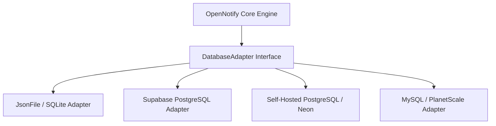

# 🗄️ OpenNotify Multi-Database Integration & Architecture Guide

OpenNotify features an extensible **Hexagonal Storage Adapter Architecture**. You can run it on **Zero-Config Local SQLite** for free, sync with **Supabase Cloud PostgreSQL**, or connect to your own **Self-Hosted PostgreSQL, MySQL, or Neon** database.

---

## 🏗️ Storage Adapter Architecture



---

## 1. Zero-Config Local SQLite (Default Mode)

* **Cost:** $0 Forever (Runs in memory and stores persistent JSON/SQLite data in `./data/`).
* **Ideal for:** Local development, small-to-medium websites, self-hosted Docker instances.
* **Configuration:**
  ```env
  DATABASE_TYPE=sqlite
  SQLITE_DB_PATH=./data/opennotify.db
  ```
* **How it works:** OpenNotify automatically initializes the database tables and pre-seeds default authentication templates on first boot. No manual migrations needed!

---

## 2. Supabase Cloud PostgreSQL Integration

* **Cost:** Free Tier (500MB DB, 50,000 MAU, unlimited API requests for $0/mo).
* **Ideal for:** Multi-server deployments, Next.js/React cloud apps, teams using Supabase Auth / Database.
* **Configuration (`.env`):**
  ```env
  DATABASE_TYPE=supabase
  SUPABASE_URL=https://your-project-id.supabase.co
  SUPABASE_SERVICE_ROLE_KEY=your_supabase_service_role_key
  ```

### 📋 Supabase SQL Schema Setup
1. Go to your **Supabase Dashboard** → **SQL Editor**.
2. Run the following script (also found in [`supabase_schema.sql`](file:///c:/Users/panda/OneDrive/Desktop/notification-/supabase_schema.sql)):

```sql
-- 1. Registered Users Table
CREATE TABLE IF NOT EXISTS public.opennotify_users (
  id UUID PRIMARY KEY DEFAULT gen_random_uuid(),
  email TEXT UNIQUE,
  phone TEXT UNIQUE,
  email_verified BOOLEAN DEFAULT false,
  phone_verified BOOLEAN DEFAULT false,
  metadata JSONB DEFAULT '{}'::jsonb,
  created_at TIMESTAMPTZ DEFAULT now(),
  updated_at TIMESTAMPTZ DEFAULT now()
);

-- 2. HMAC Cryptographic Tokens Store
CREATE TABLE IF NOT EXISTS public.opennotify_tokens (
  id UUID PRIMARY KEY DEFAULT gen_random_uuid(),
  identifier TEXT NOT NULL,
  token_hash TEXT NOT NULL,
  type TEXT NOT NULL,
  expires_at TIMESTAMPTZ NOT NULL,
  attempts INTEGER DEFAULT 0,
  consumed BOOLEAN DEFAULT false,
  created_at TIMESTAMPTZ DEFAULT now()
);

-- 3. Multi-Channel Notification Templates
CREATE TABLE IF NOT EXISTS public.opennotify_templates (
  id TEXT PRIMARY KEY,
  channel TEXT NOT NULL DEFAULT 'email',
  name TEXT NOT NULL,
  subject TEXT,
  body TEXT NOT NULL,
  variables JSONB DEFAULT '[]'::jsonb,
  is_system BOOLEAN DEFAULT false,
  created_at TIMESTAMPTZ DEFAULT now(),
  updated_at TIMESTAMPTZ DEFAULT now()
);

-- 4. Interactive WhatsApp Templates
CREATE TABLE IF NOT EXISTS public.opennotify_whatsapp_templates (
  id TEXT PRIMARY KEY,
  name TEXT NOT NULL,
  category TEXT DEFAULT 'utility',
  header_text TEXT,
  body TEXT NOT NULL,
  footer_text TEXT,
  buttons JSONB DEFAULT '[]'::jsonb,
  variables JSONB DEFAULT '[]'::jsonb,
  is_system BOOLEAN DEFAULT false,
  created_at TIMESTAMPTZ DEFAULT now(),
  updated_at TIMESTAMPTZ DEFAULT now()
);

-- 5. WhatsApp Automation Flow Rules
CREATE TABLE IF NOT EXISTS public.opennotify_whatsapp_rules (
  id TEXT PRIMARY KEY,
  name TEXT NOT NULL,
  trigger_type TEXT NOT NULL,
  trigger_value TEXT NOT NULL,
  response_type TEXT NOT NULL DEFAULT 'text',
  response_text TEXT,
  response_template_id TEXT,
  buttons JSONB DEFAULT '[]'::jsonb,
  enabled BOOLEAN DEFAULT true,
  created_at TIMESTAMPTZ DEFAULT now(),
  updated_at TIMESTAMPTZ DEFAULT now()
);

-- 6. Audit & Delivery Logs
CREATE TABLE IF NOT EXISTS public.opennotify_delivery_logs (
  id UUID PRIMARY KEY DEFAULT gen_random_uuid(),
  channel TEXT NOT NULL,
  provider TEXT NOT NULL,
  recipient TEXT NOT NULL,
  template_id TEXT,
  status TEXT NOT NULL,
  error_message TEXT,
  metadata JSONB DEFAULT '{}'::jsonb,
  created_at TIMESTAMPTZ DEFAULT now()
);

-- Enable Row Level Security (RLS)
ALTER TABLE public.opennotify_users ENABLE ROW LEVEL SECURITY;
ALTER TABLE public.opennotify_tokens ENABLE ROW LEVEL SECURITY;
ALTER TABLE public.opennotify_templates ENABLE ROW LEVEL SECURITY;
ALTER TABLE public.opennotify_whatsapp_templates ENABLE ROW LEVEL SECURITY;
ALTER TABLE public.opennotify_whatsapp_rules ENABLE ROW LEVEL SECURITY;
ALTER TABLE public.opennotify_delivery_logs ENABLE ROW LEVEL SECURITY;
```

---

## 3. Self-Hosted PostgreSQL / Neon / AWS RDS

To connect standard PostgreSQL without the Supabase client:
1. Set up standard connection string pool.
2. Run the above PostgreSQL schema.
3. OpenNotify automatically executes queries through the `DatabaseAdapter` interface.

---

## 4. Custom Database Adapters

If your in-house stack uses MongoDB, DynamoDB, or MySQL, you only need to implement the [`DatabaseAdapter`](file:///c:/Users/panda/OneDrive/Desktop/notification-/src/db/database.ts) interface in TypeScript:

```typescript
export interface DatabaseAdapter {
  init(): Promise<void>;
  getUserByEmail(email: string): Promise<User | null>;
  getUserByPhone(phone: string): Promise<User | null>;
  createUser(userData: Partial<User>): Promise<User>;
  updateUser(id: string, updates: Partial<User>): Promise<User | null>;
  storeToken(tokenRecord: TokenRecord): Promise<void>;
  getToken(identifier: string, type: 'otp' | 'magic_link'): Promise<TokenRecord | null>;
  incrementTokenAttempts(identifier: string, type: 'otp' | 'magic_link'): Promise<number>;
  consumeToken(identifier: string, type: 'otp' | 'magic_link'): Promise<void>;
  // Multi-Channel Template & WhatsApp methods...
}
```

---

## 5. Production Healthcheck & Monitoring

OpenNotify includes a built-in healthcheck endpoint:
```http
GET /api/health
```

**Response:**
```json
{
  "status": "ok",
  "database": "sqlite",
  "mailProvider": "dev",
  "smsProvider": "dev",
  "whatsappProvider": "dev",
  "timestamp": "2026-08-17T03:54:00.000Z"
}
```
Use this endpoint with **Uptime Kuma**, **Datadog**, or **AWS ALB** for zero-downtime monitoring.
